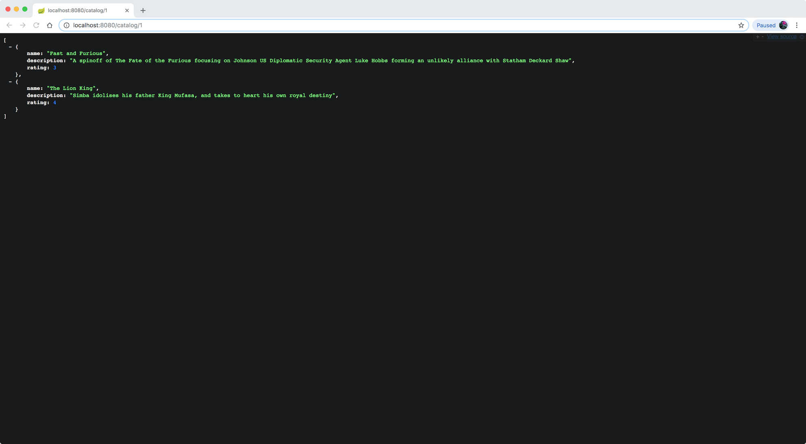
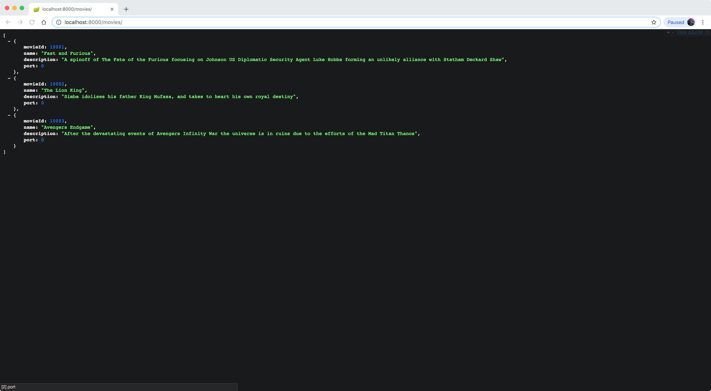
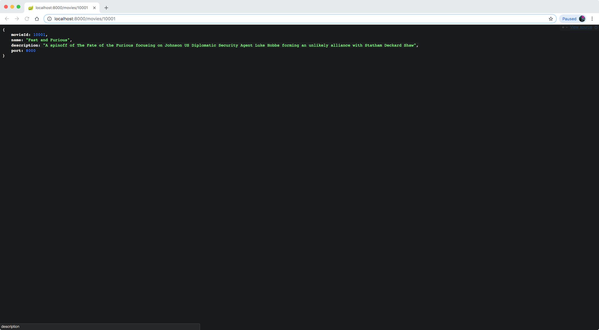
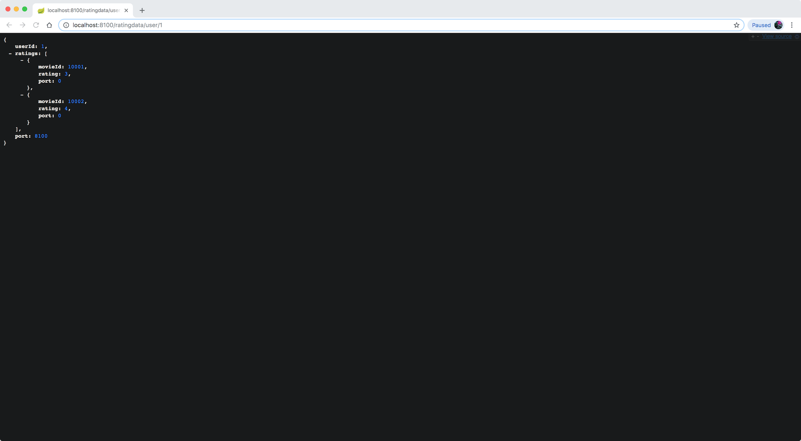
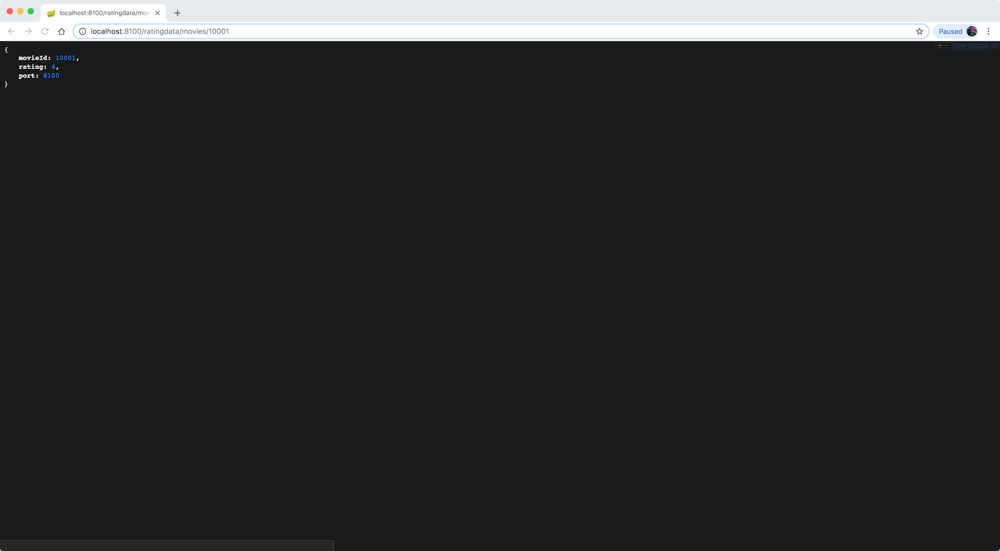
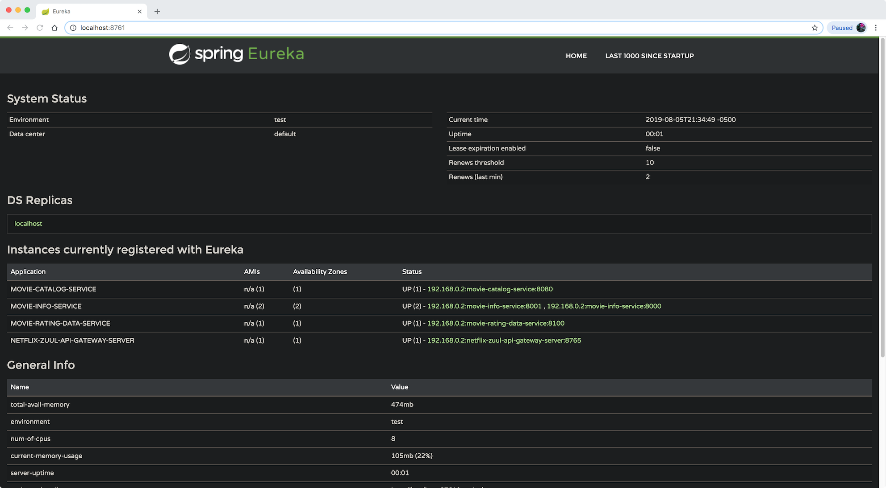
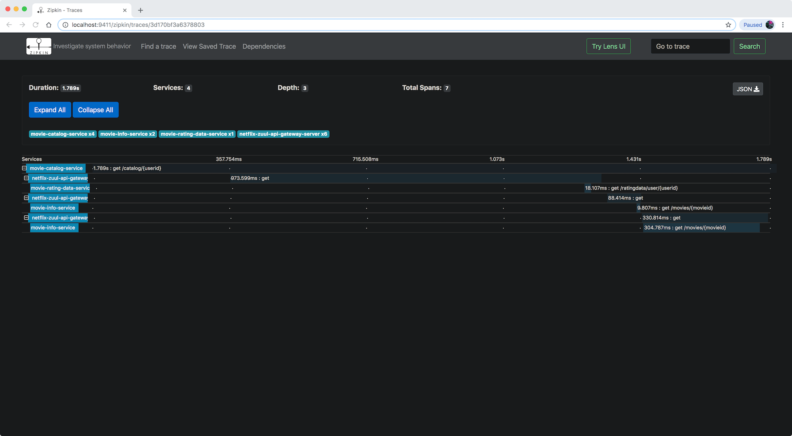

# Movie-Catalog-API-App
A catalog service consolidating movie info service and rating data service in microservice architecture.

## Overview
This project is to build three microservices and each of which serves as an independent application communicating amongst each other through API calls. The first application is a movie information service which provides all details of movies. The second application is a rating data service which provides all ratings of movies given by a specific user. The third application serves as a catalog service orchestrating the other two services and providing meaningful data to clients.

## Architecture

## Ports
|     Applications       |     Ports         |
| ------------- | ------------- |
| Movie Catalog Service | 8080 |
| Movie Info Service | 8000, 8001, 8002, ... |
| Movie Rating Data | 8100, 8101, 8102, ...  |
| Spring Cloud Config Server | 8888 |
| Netflix Eureka Naming Server | 8761 |
| Netflix Zuul API Gateway Server | 8765 |
| Zipkin Distributed Tracing Server | 9411 |

## Endpoints
|     Applications       |     URLs          |
| ------------- | ------------- |
| Movie Catalog Service | http://localhost:8080/catalog/1 |
| Movie Info Service | http://localhost:8000/movies/ http://localhost:8000/movies/10001 |
| Movie Rating Data | http://localhost:8100/ratingdata/user/1 http://localhost:8100/ratingdata/movies/10001 |
| Netflix Eureka Naming Server | http://localhost:8761/ |
| Netflix Zuul API Gateway Server | http://localhost:8765/movie-info-service/movies/10001 http://localhost:8765/movie-rating-data-service/ratingdata/user/1 |
| Zipkin Distributed Tracing Server | http://localhost:9411/ |
| Spring Cloud Bus Refresh | http://localhost:8080/actuator/bus/refresh |

## Implementation
### IDE
* Spring Tool Suite 4

### Database
* H2

### RabbitMQ
* **Installation**
```
brew update
brew install rabbitmq
```
 * https://www.rabbitmq.com/install-homebrew.html
### Zipkin
* **Installation**
```
curl -sSL https://zipkin.io/quickstart.sh | bash -s
```
* **Start Server**
* First start RabbitMQ 
```
/usr/local/sbin/rabbitmq-server
```
* Start Zipkin
```
RABBIT_ADDRESSES=localhost java -jar zipkin.jar
```
* https://zipkin.io/pages/quickstart

## Fixed Issues
1) Run multiple instances
* VM Argument (Run Configurations): 
```
-Dserver.port=8001
```
2) Find and kill processes locking ports on Mac
* Find: ``[sudo] lsof -i :3000``
* Kill: ``kill -9 <PID>``
3) Calling a service with multiple feign clients by the same name
- Issue: https://github.com/spring-cloud/spring-cloud-netflix/issues/1139
- Solution:  https://stackoverflow.com/questions/52850357/migration-netflix-feign-in-springboot-1-x-to-openfeign-in-springboot-2-x
- Discussion:\
If we want to create multiple feign clients with the same name or url so that they would point to the same server but each with a different custom configuration then we have to use contextId attribute of the @FeignClient in order to avoid name collision of these configuration beans.\
Feign uses the fully qualified class name as the bean name and the name attribute is the bean name and should be unique.\
The name of the bean in the application context is the fully qualified name of the interface (server name).\
The Ribbon client will want to discover the physical addresses for the service of that name.\
The problem is we have a context per named feign client. So the context name needs to be the same as the bean name so as to not conflict. That's why putting "http://" on the front fixes this.\
Thus, using the fully qualified class name as the name of the context (same as the bean name) so that the configuration contexts are unique.

```java
@FeignClient(contextId = "fooClient", name = "serverName", configuration = FooConfiguration.class)
public interface FooClient {
    //..
}

@FeignClient(contextId = "barClient", name = "serverName", configuration = BarConfiguration.class)
public interface BarClient {
    //..
}
```
4) H2-console not working while the database has been correctly built 
- https://stackoverflow.com/questions/56838165/h2-console-stopped-working-after-updating-from-spring-cloud-greenwich-sr1-to-sr2

## Snapshots
### Movie Catalog Service


### Movie Info Service



### Movie Rating Data Service



### Eureka Naming Server


### Zipkin Distributed Tracing Server

